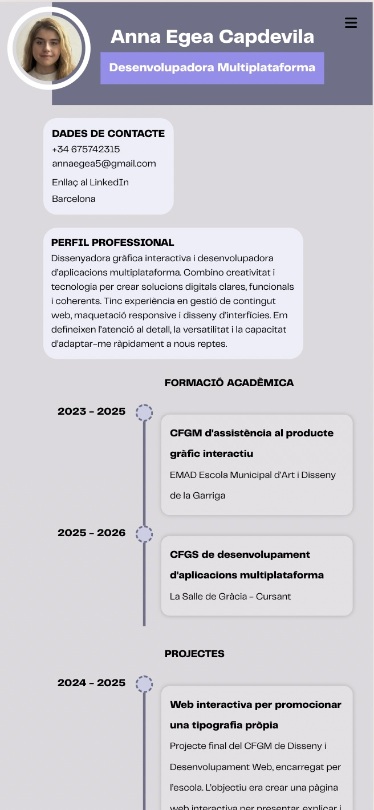
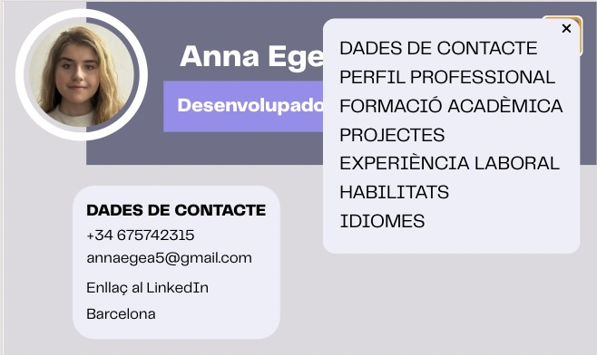
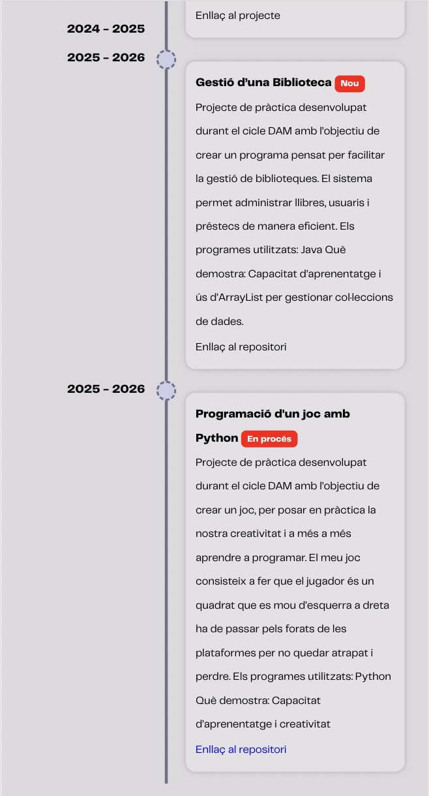

# Currículum Web — Anna Egea Capdevila
Pàgina web personal per presentar el Currículum Vitae, desenvolupada com a projecte acadèmic amb HTML5, CSS3 i JavaScript. Segueix la metodologia Mobile First, amb disseny responsive, optimitzada per a impressió i descàrrega.

## Demo en línia
🔗 [Veure projecte](https://0373-dam-pr1-annaegea07.vercel.app/)

## Estructura de carpetes
```text
0373-dam-pr1-annaegea07/
├── index.html
├── index.js
├── README.md
├── css/
│   ├── style.css
│   ├── reset.css
│   └── telegraf-fontface.css
└── assets/
    ├── favicon.png
    ├── anna-egea-perfil.jpeg
    ├── bars-solid-full.svg
    ├── Telegraf UltraLight 200.woff
    ├── Telegraf UltraBold 800.woff
    └── Telegraf Regular.woff
```
## Decisions tècniques
- **Mobile First:** El disseny s'ha estructurat primer per a mòbil i després adaptat per a pantalles més grans amb media queries.
- **Tipografia personalitzada:** S'ha utilitzat la font Telegraf amb `@font-face` per mantenir una identitat visual professional.
- **Mode impressió:** S'ha creat un full d'estils específic per a impressió que oculta elements innecessaris i mostra les URLs dels enllaços.

## 📸 Captures de pantalla

<br><br>

<br><br>


## 🛠️ Funcionalitats destacades

- **Menú hamburguesa** amb icones personalitzades ([Font Awesome](https://fontawesome.com/))
- **Timeline responsive** construïda amb CSS Grid
- **Animació CSS** aplicada a elements interactius
- **Mode impressió** amb disseny net i URLs visibles

## 🎥 Tutorial utilitzat per crear el Timeline

Per implementar la timeline, vaig seguir aquest vídeo:

[](https://youtu.be/FuJZsTt4bJA?si=Vfx7oFixIrsxHDH0)

## 🎥 Tutorial utilitzat per crear l'animació CSS

Per implementar l'animació, vaig seguir aquest vídeo:

[](https://youtube.com/shorts/taT1n9G7arE?si=CKpKJBCRinZQTTYb)


## 🔧 Tecnologies utilitzades


